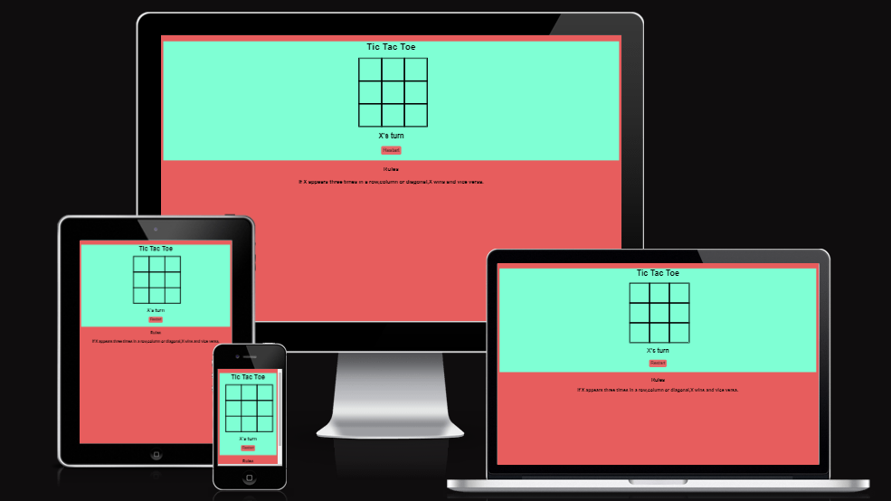
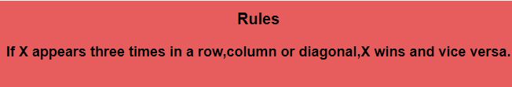
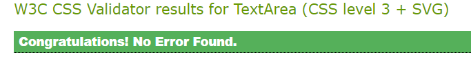
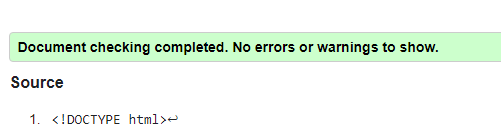
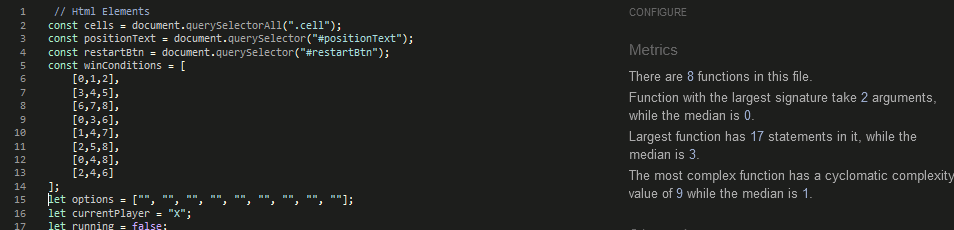
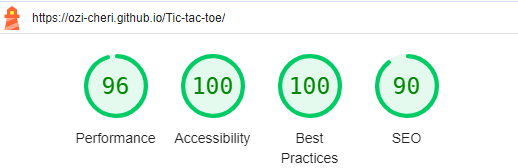

# Tic Tac Toe Game
The **Tic Tac Toe** game website is a website for parents and children who wants to relax or have fun with game. It is a responsive  an interactive game that can be viewed on any device.



## Advantages of Tic Tac Toe Game(Or games in general)

Research has shown that through games people can learn variety of important skills such as creativity,teamwork as well as boosting brain connectivity. Games are essentail for healthy development in childhood and beyond.
## Existing Features
The **Tic Tac Toe** game is made up of the following features.

* Tic Tac Toe Game Title
  * While looking at the site, the Tic tac toe game is boldy displayed at the top of the game board making it easy for the user to know the type of game they are about to play.

* The Game Container
  * This section displays the structure of the game area. It has two alphabetical letters X and O representing the two players.When  **X 's turn** is displayed on the game container,it indicates that it is **X** turn to play or start the game and vice versa. When a particular player wins,the game can easily be restarted with a Restart Button. All these feautures are boldly written and assesable to the users.
  
  

* The Game Area
  * In this section,Javascript is used for the game development because of it assessibility across different platforms and devices,e.g mobile and desktop. This area automically allows the users to play the game. The game container is made of 9 cells numbered from 0-8. An eventlistener is added to each cell. When a cell is clicked it invokes cellclicked that initiates the funtionality of the cells.

 The game is made up of 2 players, X and O. When X's turn is displayed on the game board,that means it is X's turn to start the game and vice versa.
  ## Game Rules
  Each player clicks on the cell one after the other as they play the game. If only X's should appear 3 times in each cell on any of the rows,columns or diagonals, X wins and vice versa.

  
  
  
   
  
  
  An eventlistener is added to the restart button in order to invoke the restart game funtion when clicked when a paticular player wins or when it is a draw.
  
  
  
## Features Left to Implement

* Another feature idea

## Responsive Testing

* Responsive testing on screen devices and browsers.
  * The game is responsive,looks good and works on all standard sizes using the devtool device toolbar.
  * The game is functional and looks good when tested in **Chrome** , **Firefox** and **Microsoft Edge** browsers.

## Validation Testing 

* CSS
  * No errors were found when tested through [css validator](https://jigsaw.w3.org) 
 
 
* HTML
  * No errors were found when tested through [w3c validator](https://validator.w3.org)

  

* Javascript
  * No errors were found when tested through [jshint validator](https://jshint.com)

#### The following metrics were returned when javascript was tested.
   * There are 8 functions in this file.
   * Function with the largest signature take 2 arguments, while the median is 0.
   * Largest function has 17 statemnts in it,while the median is 3.
   * The most complex function has cyclomatic complexity value of 9 while the median is 1.
    
  

   ## Accesibility 
   **Lighthouse Report** was used to measure the quality of the project performance, accessibility, best practices and SEO scores.
   
  


## Bugs 
**Solved Bugs** 
* My html code results had errors when tested for validation.
* I discovered that attribute cellindex was not allowed directly on element div.
```
<div cellindex="0" class="cell"></div>
```
* Adding **data** attribute solved the error.
```
<div data-cell-index="0" class="cell"></div>
```


## Deployment
* The site was deployed to *GitHub* pages as follows
  * Navigate to setting in the *GitHub* repository.
  * Navigate to pages section.
  * Select main branch from the source section and save.
  * Deployment to the site starts.

  The live link can be found here - <https://ozi-cheri.github.io/Tic-tac-toe/>

# Credits 

## Content 
   * The construction of index.html and Javascript were taken from Bro Code channel.Additional content was from researches and ideas i got from on youtube.
  * Styling content from Devression channel and research on youtube.
## Codes and Contents 
* I made researches on youtube regularly and below are the channels i visited.
  * The code for index.html and index.js is from Bro Code channel <https://youtube.com/@brocodez>
  * Styling idea code from Devression channel <https://youtube.com/@dev_ression>
  * Additional researches were made on youtube that also aided in the development of this project.
  * How to add data attribute idea from OpenJavascript <https://youtube.com/@openjavascript>
  * How to add footer W3Schools <https://www.w3schools.com>

## Acknowledgments
  * Code Institute for this great platform, student care, slack community and tutor department for their supports.
  * My husband,for supporting me to enroll for this program.
  * My mentor Spencer, for his encouragement and direction.
  
