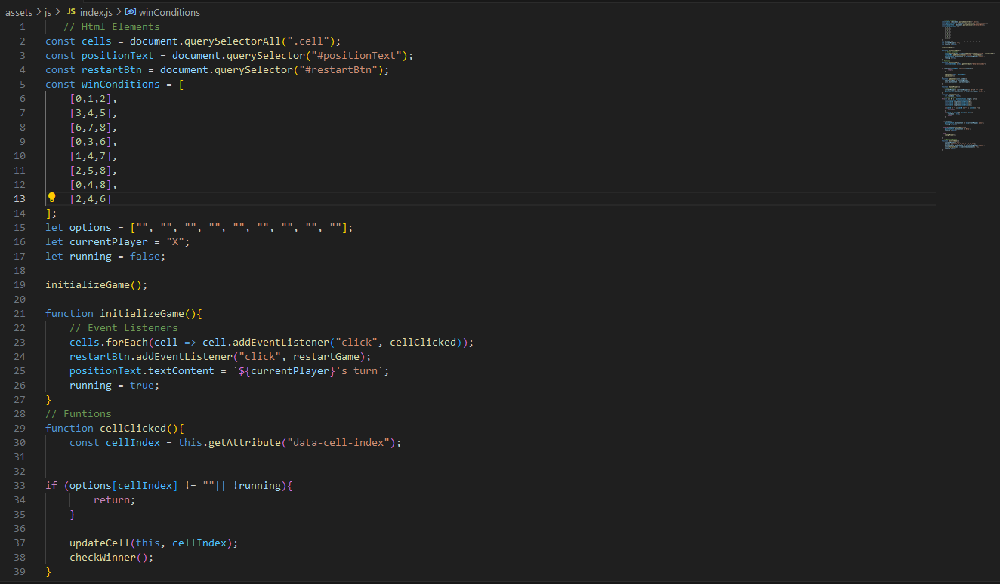

# Tic Tac Toe Game
The **Tic Tac Toe** game website is a website for parents and children who wants to relax or have fun with game. Some people think that games are made only for children, but Hey! It is for everybody. It is a responsive  an interactive game that can be viewed on any device.

## Advantages of Tic Tac Toe Game(Or games in general)

Research has shown that through games people can learn variety of important skills such as creativity,teamwork as well as boosting brain connectivity. Games are essentail for healthy development in childhood and beyond.
## Existing Features
The **Tic Tac Toe** game is made up of the following features.

* Tic Tac Toe Game Title
  * While looking at the site, the Tic tac toe  game is boldy displayed at the top of the game board making it easy for the user to know the type of game they are about to play.

* The Game Container
  * This section displays the structure of the game area. It has two alphabetical letters X and O representing the two players.When  **X 's turn** is displayed on the game container,it indicates that it is **X** turn to play or start the game and vice versa. When a particular player wins,the game can easily be restarted with a Restart Button. All these feautures are boldly written and assesable to the users.
  
  

* The Game Area
  * In this section,Javascript is used for the game development because of it assessibility across different platforms and devices,e.g mobile and desktop. This area automically allows the users to play the game. The game container is made of 9 cells numbered from 0-8. An eventlistener is added to each cell. When a cell is clicked it invokes cellclicked that initiates the funtionality of the cells.
  
   
  
  The game is made up of 2 players, X and O. When X's turn is displayed on the game board,that means it is X's turn to start the game and vice versa.
  ## Game Rules
  Each player clicks on the cell one after the other as they play the game. If only X's should appear 3 times in each cell on any of the rows,columns or diagonals, X wins and vice versa.

  
  
  
   
  
  An eventlistener is added to the restart button in order to invoke the restart game funtion when clicked when a paticular player wins or when it is a draw.
  
  
## Features Left to Implement

* Another feature idea

## Responsive Testing

* Responsive testing on screen devices and browsers
  * The game is responsive,looks good and works on all standard sizes using the devtool divice toolbar.
  * The game is functional when tested in **Chrome** and **Firefox** browsers.

## Validator Testing 

* CSS
  * No errors were found when tested through [css validator](https://jigsaw.w3.org) 

* HTML
  * No errors were found when tested through [w3c validator](https://validator.w3.org) 

* Javascript
  * No errors were found when tested through [jshint validator](https://jshint.com)

## Bugs

## Deployment
* The site was deployed to *GitHub* pages as follows
  * Navigate to setting in the *GitHub* repository.
  * Navigate to pages section.
  * Select main branch from the source section and save.
  * Deployment to the site starts.

  The live link can be found here - <https://ozi-cheri.github.io/Tic-tac-toe/>

# Credits 

## Content And Codes
* Bro Code channel <https://youtube.com/@brocodez>
* Background colour idea and styling from
  * Devression channel <https://youtube.com/@dev_ression>

  
